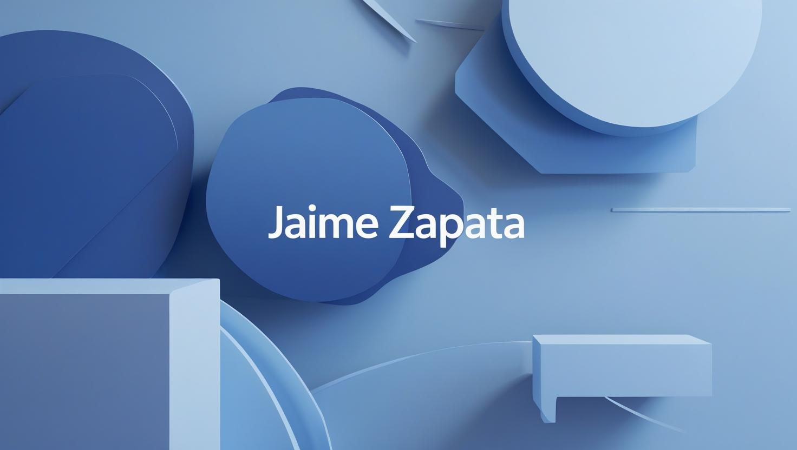

  

# ✏️ Bitácora: El profe Jaime

📚 Una app personal, ligera y significativa para registrar notas de clase y preguntas frecuentes, construida con amor, código y vocación docente.

---

## 👋 Bienvenido

Hola, soy **Jaime Zapata** — desarrollador Front-End, docente de desarrollo de software y apasionado por enseñar de forma clara, cercana y con propósito.

Esta aplicación es mi forma de conectar dos mundos que amo: **enseñar** y **crear con código**.  
Quería una solución propia, práctica y humana para compartir con mis estudiantes lo esencial de cada clase, sin depender de plataformas rígidas o procesos innecesarios.

---

## 🎯 ¿Por qué esta aplicación?

Durante cada clase, suelo abrir un bloc de notas donde escribo ideas clave, reflexiones espontáneas o explicaciones que surgen naturalmente.  
Pero luego, compartir ese contenido con los estudiantes en plataformas como Moodle resulta lento, mecánico y poco amigable.

Así nació esta app:  
> Un espacio **ágil, bonito y muy mío**, donde puedo guardar lo esencial de cada semana y compartirlo de forma rápida y organizada.

---

## 🧠 Propósito

**Bitácora: El profe Jaime** busca ser una extensión viva de mi forma de enseñar:  
clara, tranquila, directa y con foco en lo importante.  
Es una herramienta para **comunicar, recordar y acompañar** a mis estudiantes más allá del aula.

---

## 👥 Público objetivo

- 🎓 **Estudiantes**: acceden a las notas y preguntas frecuentes por materia y semana.
- 👨‍🏫 **Yo mismo como profesor**: registro conceptos, ideas y dudas clave durante o después de clase.

---

## ✅ Objetivos

- Organizar contenido de clase por semanas y materias, de forma clara y sencilla.
- Facilitar el acceso de los estudiantes al material sin complicaciones.
- Ahorrar tiempo a la hora de subir contenido importante.
- Reforzar mi propio proceso como docente.

---

## ⚙️ Funcionalidades

| Funcionalidad                          | Descripción                                                                 |
|----------------------------------------|-----------------------------------------------------------------------------|
| 🔐 Autenticación con Firebase          | Login y registro para estudiantes y profesor                               |
| 🧑‍🏫 Rol profesor                       | Acceso al panel de gestión: materias, semanas, notas rápidas y FAQs        |
| 🎓 Rol estudiante                      | Navegación por materia y semana con acceso solo lectura                     |
| 🗂️ Gestión de materias y semanas       | Crear, editar y asociar contenido organizado por semana                     |
| 📝 Notas rápidas                       | Registro de ideas, conceptos clave o explicaciones tipo post-it            |
| ❓ Preguntas frecuentes (FAQ)          | Sección de preguntas comunes por semana para reforzar conceptos            |
| 🌐 Interfaz pública protegida          | Solo usuarios autenticados pueden acceder, según su rol                    |
| 📱 Responsive y rápida                 | Diseñada para funcionar bien en móviles, tablets y PC                      |

---

## 🛠️ Tecnologías utilizadas

| Herramienta | Descripción |
|------------|-------------|
|  **React + Vite** | Framework SPA ligero, moderno |
|  **Firebase Auth + Firestore** | Autenticación y base de datos cloud |
|  **Tailwind CSS** | Framework CSS para diseño minimalista |
|  **JavaScript (ES6+)** | Lógica de interfaz y conexión con Firebase |
|  **Git + GitHub** | Control de versiones |
|  **Vercel** | Hosting del frontend |

---

## 🚀 Vista previa

  

> Puedes ver la app funcionando en:  
> 🔗 **[bitacora.vercel.app](https://bitacora.vercel.app)**

---

## 🧩 Lo que aprendí al crear esta app

✅ Que enseñar también se puede transformar en código.  
✅ Que lo simple, cuando está bien hecho, tiene mucho poder.  
✅ Que crear herramientas propias como docente es una forma de amor por la educación.  
✅ Que el compromiso con el estudiante va más allá del aula.

---

## ❤️ Conclusión

**Bitácora: El profe Jaime** no es solo una app:  
es una forma de mantener vivo lo que ocurre en cada clase.  
Es **mi manera de enseñar, organizada y accesible** para quienes quieran aprender conmigo, dentro o fuera del aula.

---

> 🎉 Gracias por visitar este proyecto.  
> Si te inspira, si te sirve, o si quieres usarlo como base para tu propia bitácora docente, ¡bienvenido!  
>  
> 🙌 Hecho con calma, pasión y cariño.  
> — *Jaime Zapata*
